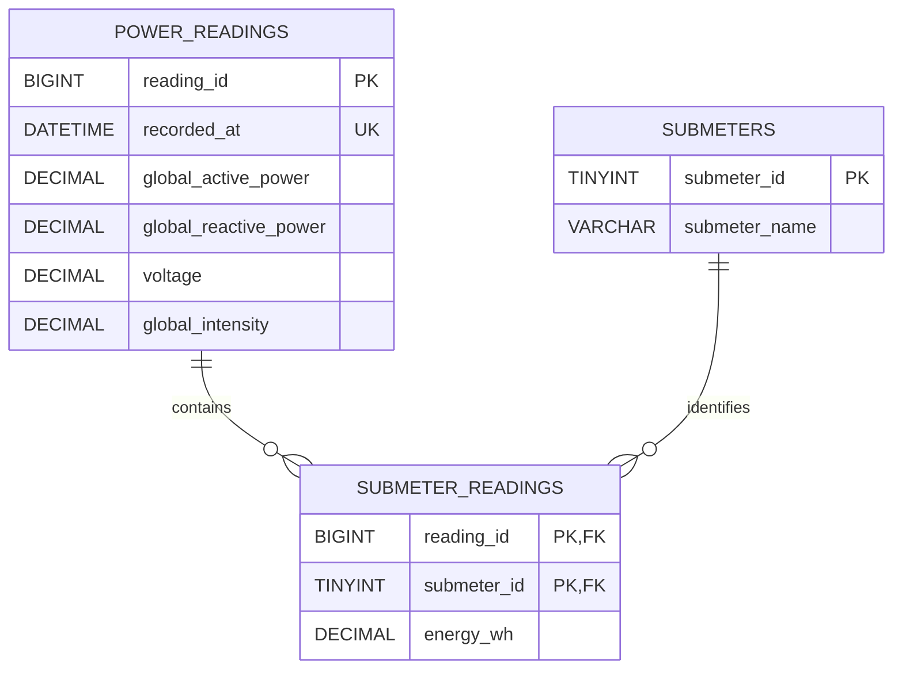

# Entity Relationship Diagram

## Household Electricity Consumption Database

The relational database contains three tables:
- power_readings
- submeters
- submeter_readings

```mermaid
erDiagram

    POWER_READINGS {
        BIGINT reading_id PK
        DATETIME recorded_at UK
        DECIMAL global_active_power
        DECIMAL global_reactive_power
        DECIMAL voltage
        DECIMAL global_intensity
    }

    SUBMETERS {
        TINYINT submeter_id PK
        VARCHAR submeter_name
    }

    SUBMETER_READINGS {
        BIGINT reading_id PK,FK
        TINYINT submeter_id PK,FK
        DECIMAL energy_wh
    }

    POWER_READINGS ||--o{ SUBMETER_READINGS : contains
    SUBMETERS ||--o{ SUBMETER_READINGS : identifies
```
